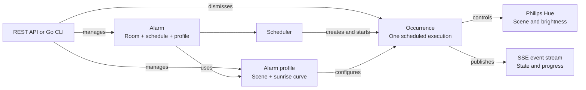

# Huerise

Huerise is gradual, Hue-based sunrise light automation. It ramps a Hue scene's
brightness up over a configured wake-up window on a schedule. Alarms can be
managed through a REST API or the included Go CLI, making Huerise easy to
connect to your preferred AI agent or automation workflow.

## Table of contents

- [How it works](#how-it-works)
- [Features](#features)
- [Quick start](#quick-start)
- [API](#api)
  - [Authentication and documentation](#authentication-and-documentation)
  - [API capabilities](#api-capabilities)
  - [Event stream](#event-stream)
- [CLI](#cli)
  - [Build and configure](#build-and-configure)
  - [Command overview](#command-overview)
  - [Command reference](#command-reference)
  - [Automation and output](#automation-and-output)
- [Configuration](#configuration)
- [Local development](#local-development)
- [Tech stack](#tech-stack)

## How it works

Huerise separates _when_ an alarm runs from _how_ it lights the room:

- An **alarm** selects a room, schedule, and alarm profile. A schedule without
  weekdays runs once; a schedule with weekdays repeats in its configured IANA
  timezone.
- An **alarm profile** combines a Hue scene with a sunrise duration and
  brightness range. Profiles can be reused by multiple alarms.
- An **occurrence** records one execution of an alarm, including its state,
  timestamps, and any failure.



At the scheduled time, Huerise recalls the selected scene at low brightness
and raises the room brightness in steps until it reaches the configured
ceiling (or the scene's own brightness, whichever is lower), then restores the
scene exactly as stored in Hue and finishes the occurrence. The occurrence can
be dismissed early through the API or CLI. If a Hue room or scene has been
removed, the alarm is marked as defective and the occurrence still finishes
rather than blocking on a bridge that will not resolve.

The scheduler keeps running in the API process, ticking on an interval to
materialise and dispatch due occurrences. Alarm state is persisted in SQLite,
and live changes are published through a server-sent events stream.

## Features

- Gradual sunrise simulation using Philips Hue rooms and scenes
- One-time and weekday-based recurring alarms with timezone support
- Reusable alarm profiles
- Enable, disable, update, dismiss, and delete operations
- Hue scene preview and accelerated sunrise demo
- REST API with OpenAPI documentation and bearer-token authentication
- Server-sent events for alarm and occurrence updates
- Typed Go CLI with human-readable tables and stable JSON output

## Quick start

### Prerequisites

- Docker and Docker Compose
- A Philips Hue Bridge reachable from the host

### 1. Configure the environment

Copy the example file:

```bash
cp .env.example .env
```

Set at least these values in `.env`:

```dotenv
AUTH_JWT_SECRET=replace-with-a-long-random-secret
```

Huerise refuses to start without `AUTH_JWT_SECRET` -- it signs the access
tokens issued at login. Generate a suitable secret with:

```bash
python -c "import secrets; print(secrets.token_urlsafe(32))"
```

After startup, discover and register a Hue Bridge through the `/hue` setup
routes. `HUE_BRIDGE_IP` and `HUE_APP_KEY` may instead be set together as an
operator-controlled deployment override.

### 2. Start Huerise

```bash
docker compose up -d
```

Compose applies the database migrations, starts the API at
`http://localhost:8000`, and exposes these supporting services:

| Service    | URL                          | Purpose                     |
| ---------- | ----------------------------- | --------------------------- |
| Swagger UI | `http://localhost:8000/docs` | Explore and call the API    |
| Adminer    | `http://localhost:8080`      | Inspect the SQLite database |

### 3. Verify the API

```bash
ACCESS_TOKEN=$(curl -s -X POST http://localhost:8000/auth/register \
  -H "Content-Type: application/json" \
  -d '{"username": "you", "password": "a-strong-passphrase"}' | jq -r .access_token)

curl -H "Authorization: Bearer $ACCESS_TOKEN" \
  http://localhost:8000/alarms
```

## API

The API is available at `http://localhost:8000` by default. Resource IDs are
UUIDs. Request and response schemas, validation constraints, and example
responses are defined in the checked-in [`openapi.json`](openapi.json).

### Authentication and documentation

Register or log in via `/auth/register` or `/auth/login` to receive a
short-lived access token and a longer-lived refresh token. Every other route
requires the access token:

```http
Authorization: Bearer <access_token>
```

Access tokens expire quickly; call `/auth/refresh` with the refresh token to
get a new pair before that happens.

Missing, malformed, or incorrect credentials return `401 Unauthorized` with a
`WWW-Authenticate: Bearer` header. There are no user accounts or token-creation
routes.

Interactive API documentation is available at `http://localhost:8000/docs`.
Select **Authorize** and enter the configured token before making requests.

### API capabilities

#### Alarms

| Method   | Route                            | Capability                                          |
| -------- | --------------------------------- | ---------------------------------------------------- |
| `GET`    | `/alarms`                        | List all alarms                                     |
| `POST`   | `/alarms`                        | Create an alarm                                     |
| `GET`    | `/alarms/{alarm_id}`             | Get one alarm                                       |
| `PATCH`  | `/alarms/{alarm_id}`             | Update an alarm's label, schedule, room, or profile |
| `DELETE` | `/alarms/{alarm_id}`             | Delete an alarm                                     |
| `POST`   | `/alarms/{alarm_id}/enable`      | Enable a disabled alarm                             |
| `POST`   | `/alarms/{alarm_id}/disable`     | Disable an enabled alarm                            |
| `POST`   | `/alarms/{alarm_id}/dismiss`     | Dismiss the active occurrence                       |
| `GET`    | `/alarms/{alarm_id}/occurrences` | List recent occurrences; accepts `limit`            |

#### Alarm profiles

| Method   | Route                          | Capability                                       |
| -------- | ------------------------------ | ------------------------------------------------- |
| `GET`    | `/alarm-profiles`              | List reusable alarm profiles                     |
| `POST`   | `/alarm-profiles`              | Create a profile from a scene and sunrise settings |
| `DELETE` | `/alarm-profiles/{profile_id}` | Delete an alarm profile                          |

#### Hue setup and diagnostics

| Method | Route                  | Capability                                     |
| ------ | ---------------------- | ------------------------------------------------ |
| `GET`  | `/hue/bridges`         | Discover available Hue Bridges                 |
| `GET`  | `/hue/bridge`          | Get effective Hue configuration status         |
| `PUT`  | `/hue/bridge`          | Select a bridge by its stable bridge ID        |
| `POST` | `/hue/bridge/register` | Register after pressing the bridge link button |
| `GET`  | `/doctor`              | Check Hue Bridge configuration                 |

#### Rooms and scenes

| Method   | Route                                         | Capability                                         |
| -------- | --------------------------------------------- | --------------------------------------------------- |
| `GET`    | `/rooms`                                      | List Hue rooms and their scenes                    |
| `GET`    | `/rooms/{room_id}`                            | Get one room and its scenes                        |
| `POST`   | `/rooms/{room_id}/scenes/{scene_id}/activate` | Preview a scene, optionally at a chosen brightness |
| `POST`   | `/rooms/{room_id}/scenes/{scene_id}/demo`     | Start an accelerated sunrise demo                  |
| `DELETE` | `/rooms/{room_id}/scenes/{scene_id}/demo`     | Stop the running sunrise demo                      |

#### Events

| Method | Route          | Capability                                        |
| ------ | -------------- | ---------------------------------------------------- |
| `GET`  | `/eventstream` | Subscribe to alarm and occurrence events over SSE |

### Event stream

`GET /eventstream` keeps displays and integrations synchronized without
polling. Each server-sent event contains an ID, a typed event name, and a JSON
payload. Idle connections receive keepalive comments.

```bash
curl -N \
  -H "Authorization: Bearer $ACCESS_TOKEN" \
  http://localhost:8000/eventstream
```

Reconnect with the last received ID in the `Last-Event-ID` header. If that ID
has left the in-memory replay buffer, fetch `GET /alarms` first to resynchronize
the client.

## CLI

The repository contains a typed Go CLI generated from the API's OpenAPI
specification. It is designed for interactive terminal use as well as scripts:
tables are the default for people, while JSON and field selection provide a
stable automation interface.

### Build and configure

The CLI requires Go 1.25 or newer:

```bash
make build
./bin/huerise --help
```

On Windows without `make`:

```powershell
go -C cli build -o ../bin/huerise.exe ./cmd/huerise
```

The CLI reads `.env` by default and connects to `http://localhost:8000`. Log
in once and it stores a token pair per-machine at `~/.huerise/credentials.json`,
refreshing it automatically as it expires:

```bash
huerise auth register --username alice   # first account on a fresh install
huerise auth login --username alice      # on any later machine
```

An explicit `HUERISE_API_TOKEN` (or hidden `--token`) still overrides stored
credentials, which is useful for scripting with a long-lived access token.
Use `HUERISE_API_URL` for a different server, or pass `--env-file` and
`--api-url` explicitly.

### Command overview

```text
huerise
|-- auth
|   |-- register
|   |-- login
|   `-- logout
|-- alarms
|   |-- list
|   |-- create
|   |-- get
|   |-- enable
|   |-- disable
|   |-- dismiss
|   |-- occurrences
|   `-- delete
|-- profiles
|   |-- list
|   |-- create
|   `-- delete
|-- rooms
|   |-- list
|   |-- get
|   |-- activate-scene
|   |-- demo
|   `-- stop-demo
|-- hue
|   `-- bridge
|       |-- list
|       |-- status
|       |-- select
|       `-- register
|-- doctor
`-- version
```

Run `huerise <command> --help` for all arguments and defaults. Typical calls:

```bash
huerise rooms list
huerise profiles list
huerise alarms create "Weekday sunrise" --room Bedroom --hour 7 --minute 0 \
  --day mon --day tue --day wed --day thu --day fri
huerise alarms occurrences ALARM_ID --limit 10
huerise rooms demo Bedroom Energize --duration-seconds 20
huerise hue bridge list
huerise doctor
```

The CLI resolves room and scene names case-insensitively and sends their UUIDs
to the API.

### Command reference

Arguments in angle brackets are required. Options in square brackets are
optional. UUIDs returned by list commands can be passed to commands that expect
an ID.

#### Alarms

| Command                                                                     | Purpose and options                                                                                                                                                      |
| ---------------------------------------------------------------------------- | --------------------------------------------------------------------------------------------------------------------------------------------------------------------- |
| `huerise alarms list`                                                       | List every alarm.                                                                                                                                                        |
| `huerise alarms create <label> --room <name> --hour <0-23> --minute <0-59>` | Create an alarm. Optional: `--timezone <IANA>` (default `Europe/Berlin`), repeatable `--day <mon-sun>`, and `--profile-id <UUID>`. Without `--day`, the alarm runs once. |
| `huerise alarms get <alarm-id>`                                             | Show one alarm.                                                                                                                                                          |
| `huerise alarms enable <alarm-id>`                                          | Enable a disabled alarm.                                                                                                                                                 |
| `huerise alarms disable <alarm-id>`                                         | Disable an enabled alarm.                                                                                                                                                |
| `huerise alarms dismiss <alarm-id>`                                         | Dismiss the active occurrence.                                                                                                                                           |
| `huerise alarms occurrences <alarm-id> [--limit <number>]`                  | List recent occurrences; the default limit is 20.                                                                                                                        |
| `huerise alarms delete <alarm-id> [--yes]`                                  | Delete an alarm. `--yes` skips the confirmation prompt.                                                                                                                  |

#### Profiles

| Command                                                              | Purpose and options                                                                                                                                                                                       |
| ----------------------------------------------------------------------- | ----------------------------------------------------------------------------------------------------------------------------------------------------------------------------------------------------------- |
| `huerise profiles list`                                              | List every alarm profile.                                                                                                                                                                                  |
| `huerise profiles create <name> --room <name>`                       | Create a profile. Optional: `--scene-name <name>` (default `Tageslichtwecker`), `--duration-minutes <0-120>` (default `7`), `--brightness-start <1-99>` (default `1`), and `--brightness-end <2-100>` (default `100`). |
| `huerise profiles delete <profile-id> [--yes]`                       | Delete a profile. `--yes` skips the confirmation prompt.                                                                                                                                                  |

#### Hue setup and diagnostics

| Command                                          | Purpose and options                                                                                          |
| ------------------------------------------------- | --------------------------------------------------------------------------------------------------------------- |
| `huerise hue bridge list`                        | Discover Hue Bridges and show their stable IDs, IP addresses, and selection state.                           |
| `huerise hue bridge status`                      | Show the effective Hue Bridge configuration and whether it comes from the environment or database.          |
| `huerise hue bridge select <bridge-id>`          | Persist a discovered bridge as the selected bridge.                                                         |
| `huerise hue bridge register`                    | Register the selected bridge after pressing its physical link button. The request may take up to 60 seconds. |
| `huerise doctor`                                 | Check whether the Hue Bridge is configured.                                                                 |

#### Rooms and scenes

| Command                                                              | Purpose and options                                                                                                                                                                                                                                   |
| ---------------------------------------------------------------------- | --------------------------------------------------------------------------------------------------------------------------------------------------------------------------------------------------------------------------------------------------------- |
| `huerise rooms list`                                                 | List all Hue rooms and their scenes.                                                                                                                                                                                                                  |
| `huerise rooms get <room>`                                           | Show a room and its available scenes.                                                                                                                                                                                                                 |
| `huerise rooms activate-scene <room> <scene> [--brightness <0-100>]` | Preview a scene, optionally overriding its stored brightness.                                                                                                                                                                                         |
| `huerise rooms demo <room> <scene>`                                  | Run an accelerated sunrise demo. Optional: `--duration-seconds <seconds>` (greater than 0 and at most 300; default `20`), `--brightness-start <1-100>` (default `1`), and `--brightness-end <1-100>` (default `100`); the start must be below the end. |
| `huerise rooms stop-demo <room> <scene>`                             | Stop the running sunrise demo.                                                                                                                                                                                                                        |
| `huerise version`                                                    | Print the CLI version.                                                                                                                                                                                                                                 |

### Automation and output

All data commands support these global flags:

| Flag              | Behavior                                          |
| ----------------- | ------------------------------------------------- |
| `--json`          | Emit one JSON document on stdout and never prompt |
| `--compact`       | Remove JSON indentation                           |
| `--fields=a,b`    | Select top-level fields and imply JSON output     |
| `--no-input`      | Disable interactive prompts                       |
| `--env-file PATH` | Read configuration from a different dotenv file   |
| `--api-url URL`   | Override `HUERISE_API_URL`                        |

Prompts, hints, and errors go to stderr; stdout contains result data only.
Destructive commands require `--yes` when used with `--no-input`.

```bash
huerise --no-input alarms list \
  --fields=id,label,next_occurrence --compact
huerise --no-input alarms delete ALARM_ID --yes --json --compact
```

Exit code `0` means success, `1` represents transport, API, or I/O failures,
`2` means invalid input or configuration, and `3` means authentication failed.
See [`docs/cli.md`](docs/cli.md) for the full scripting contract.

## Configuration

| Variable              | Required | Description                                          |
| ---------------------- | -------- | ----------------------------------------------------- |
| `AUTH_JWT_SECRET`     | Yes      | Signs access tokens issued by `/auth/login`          |
| `HUE_APP_KEY`         | Paired   | Optional operator override; set with bridge IP       |
| `HUE_BRIDGE_IP`       | Paired   | Optional operator override; set with app key         |
| `DATABASE_URL`        | No       | SQLAlchemy database URL; defaults to local SQLite    |
| `HUERISE_API_TOKEN`   | CLI only | Overrides the stored `huerise auth login` credentials |
| `HUERISE_API_URL`     | CLI only | CLI server URL; defaults to `http://localhost:8000`  |

Defaults suitable for local development are documented in [`.env.example`](.env.example).

## Local development

The backend requires Python 3.14+ and
[`uv`](https://docs.astral.sh/uv/).

```bash
uv sync
uv run python -m huerise.main
```

Run the backend and CLI checks with:

```bash
uv run pytest
uvx ruff check .
go -C cli test ./...
go -C cli vet ./...
```

The generated Go client lives in `cli/internal/client/`. After changing an API
route or schema, regenerate the OpenAPI document and client, then verify that no
generated changes remain:

```bash
make generate
make check-generated
```

Do not edit generated client files by hand.

## Tech stack

- Python 3.14, FastAPI, Pydantic, and Dishka
- SQLModel, SQLite, Alembic, and aiosqlite
- Philips Hue integration through [hueify](https://pypi.org/project/hueify/)
- Go 1.25 CLI generated with [ogen](https://github.com/ogen-go/ogen)
